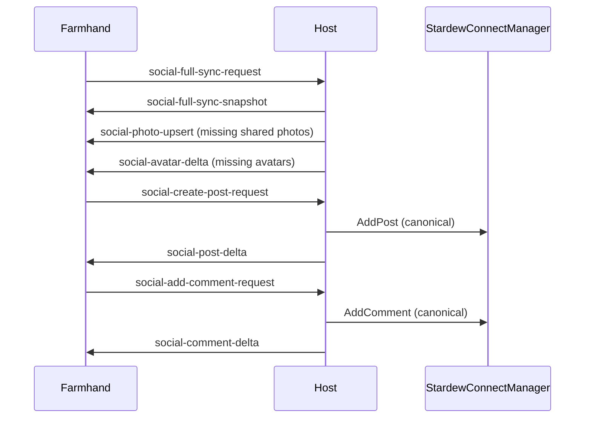

# Host/Farmhand Data Sync

This document explains how multiplayer synchronization works, with emphasis on host-authoritative social and phone APIs.

## 1. Authority Model

Core authority gates in `HelperSocial/SocialCoopSync.cs`:

- `IsFarmhandSocialPeer()`:
  - `true` when world is ready, multiplayer is active, and current player is not main player.
- `ShouldRoutePlayerSocialActionToHost()`:
  - farmhands must send create/comment/like/delete requests to host.
- `ShouldBroadcastAuthoritativeSocialChanges()`:
  - only host broadcasts canonical deltas.
- `ShouldHostRunSocialSimulation()`:
  - host (or singleplayer) runs random social simulation.

Practical result:

- Social state is host-authoritative.
- Farmhands never generate canonical social mutations locally.

## 2. Message Channels

### Social full sync and assets

- `social-full-sync-request`
- `social-full-sync-snapshot`
- `social-photo-upsert`

### Social mutation requests (farmhand -> host)

- `social-create-post-request`
- `social-add-comment-request`
- `social-set-like-request`
- `social-delete-post-request`
- `social-update-avatar-request`
- `social-direct-player-chat`

### Social mutation deltas (host -> farmhands)

- `social-post-delta`
- `social-comment-delta`
- `social-like-delta`
- `social-delete-post-delta`
- `social-avatar-delta`

### Phone API routed actions

- `phone-api-message-npc-request` / `phone-api-message-npc-apply`
- `phone-api-message-player-request` / `phone-api-message-player-apply`
- `phone-api-notification-request` / `phone-api-notification-apply`

## 3. SaveLoaded Full Sync

At `SaveLoaded` on farmhand:

1. Farmhand sends `social-full-sync-request` with:
   - request id
   - farmhand player name
   - current save folder name
   - existing `shared_photo` file names
   - existing `player_avatar` file names
2. Host handles request and computes:
   - missing files farmhand needs
   - stale files farmhand should delete
3. Host sends one snapshot message with:
   - posts
   - profile stats
   - shared player avatar mapping
   - NPC image tag snapshot
   - lists of stale photo/avatar files to delete
   - host save folder name
4. Host streams missing assets as upserts:
   - NPC photos via `social-photo-upsert`
   - player avatars via `social-avatar-delta`
5. Farmhand applies snapshot, applies upserts, deletes stale files, invalidates UI image caches.

## 4. Canonical Social Mutation Flow

### Create post

- Farmhand calls post creation.
- If farmhand:
  - builds upload payload from local `player_photo` files (base64 + tags).
  - sends `social-create-post-request`.
- Host receives request:
  - writes uploaded images into shared `shared_photo`.
  - creates canonical post via `StardewConnectManager.AddPost(...)`.
  - broadcasts `social-post-delta` with post, profile stats, and any required photo payloads.
- Farmhands upsert post from delta.

### Add comment / like / delete

- Farmhand sends request message.
- Host validates/applies using `StardewConnectManager`.
- Host broadcasts matching delta.
- Farmhands apply via `ApplySyncedComment`, `ApplySyncedLike`, `ApplySyncedPostDeletion`.

## 5. Avatar Sync

`PublishLocalPlayerAvatarSelection(...)` handles all modes:

- Singleplayer:
  - writes local avatar and updates shared avatar map locally.
- Host multiplayer:
  - writes avatar, updates map, broadcasts `social-avatar-delta`.
- Farmhand multiplayer:
  - sends `social-update-avatar-request` to host.
  - host persists + rebroadcasts canonical delta.

Avatar files are deterministic: `<playerName>_avatar.png` in `player_avatar`.

## 6. Direct Player Chat Across Peers

`TrySendDirectPlayerChat(...)`:

1. Sender resolves receiver online id.
2. Optional attached photos are copied into shared photo storage.
3. Payload includes text + shared photo upsert payloads.
4. Receiver applies photo upserts, writes messages to player-conversation key (`@player:<name>`), updates unread and UI.

## 7. Routed Phone API Behavior

Phone API message/notification calls are routed through host in multiplayer:

- Caller on farmhand sends `*-request`.
- Host dispatches to one target player when `playerId` resolves.
- If target id is empty/invalid, host applies locally then broadcasts to farmhands.
- `GetPhoneNpcList(playerId)` is special: invalid non-empty id returns empty list.

## 8. File and Tag Consistency Rules

- Shared social images are expected in `shared_photo`.
- Player avatars are expected in `player_avatar`.
- Image tags are synchronized only for relevant shared NPC photos in full sync snapshots.
- Farmhand applies host save-folder name before writing synced data.

## 9. Sequence Overview

## 10. Debug Checklist

When sync looks wrong, verify:

- Message came from expected sender (host checks `e.FromPlayerID`).
- Farmhand has matching active save folder after snapshot.
- Shared image exists in `userdata/<save>/shared_photo`.
- Avatar exists in `userdata/<save>/player_avatar`.
- UI cache invalidation happened after file writes.
