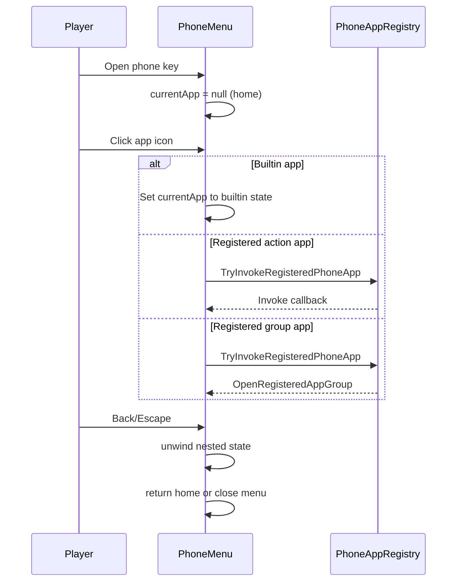

# Phone Menu Architecture

This document describes the phone UI state machine, input handling, and app routing.

## 1. Main Class and Role

- Primary class: `PhoneMenu` (`PhoneMenu.cs`) with partial extensions:
  - `HelperMessage/HelperMessage.cs` (messenger UI and chat controls)
  - `HelperSocial/PhoneMenu.Social.cs` (social UI)
- Entry point for opening menu: `OnButtonPressed` in `GameLauched.cs`.

## 2. Top-Level App State Machine

`PhoneMenu.currentApp` drives the active screen.

States:

- `null`: home screen app grid
- `appText`: messenger
- `appCamera`: camera preview/capture UI
- `appPhoto`: photo gallery
- `appSocial`: StardewConnect social app
- `appSetting`: settings
- `appNotification`: notifications
- `appExternalGroup`: registered external app group

Key transitions:

- Home icon click -> builtin app open or registered app invoke.
- Back navigation unwinds nested sub-state before returning home.
- `OpenHomeScreen()` resets text/social/group transient state and returns to home.

## 3. Draw/Update/Input Loop

### Draw (`draw`)

- Rebuilds dynamic click targets each frame per current state.
- Draws phone frame/background first, then active app content.
- For text/social/notification apps, uses scissor rectangles for viewport clipping.

### Update (`update`)

- Handles menu dragging and viewport clamping.
- Handles smooth scroll interpolation for text, social, and notification views.
- Handles cursor blink and key-repeat behavior for text inputs.
- Keeps controller snappy-menu behavior disabled while phone is open.

### Input handlers

- `receiveLeftClick`: central click router for all app states.
- `receiveScrollWheelAction`: app-specific scrolling.
- `receiveKeyPress`: escape/back behavior and typing dispatch.

## 4. Home Screen App Model

Home icons are generated via `BuildHomeAppsSnapshot()`:

- Builtin apps are always included first.
- Registered apps are appended from `PhoneAppRegistry` snapshot.
- Supports badge counts through callback delegates.
- Supports multi-page grid (`HomeAppsPerPage = 20`).

Builtin badge examples:

- Notification app: unread notification count.
- Messages app: count of conversations with unread > 0.
- Social app: active social notification count.

## 5. External App Registry Integration

Registry implementation is in `PhoneAppRegistry.cs`:

- App registration kinds:
  - normal action app
  - app group
- App group items: up to 9 items per group.
- Visibility and badge callbacks are evaluated at draw/snapshot time.
- Invocation behavior:
  - action app invokes callback
  - group app opens built-in group view
  - optional close-phone-on-launch behavior for both apps and group items

Public navigation API in `ISmartPhoneApi`:

- `OpenPhoneHomeScreen()`
- `OpenPhoneAppGroup(ownerModId, groupId)`

Both route through `ModEntry` internals and eventually `PhoneMenu.OpenHomeScreen()` / `PhoneMenu.OpenRegisteredAppGroup(...)`.

## 6. Nested State Handling

### Text app

- Two-level mode:
  - conversation list
  - selected chat
- Additional overlays:
  - suggestion bubble
  - first-message button
  - chat quick actions
  - photo picker modal

### Social app

Handled in `PhoneMenu.Social.cs` with internal flags:

- feed
- create-post menu
- post detail
- profile
- notification menu

### Settings

Sub-modes:

- setting main
- sound list
- text color list
- theme list

## 7. Back Navigation Rules

Priority-based unwind strategy:

1. Close temporary overlay first (photo picker, quick-action menu, etc).
2. Exit inner detail/list state (chat, social detail/profile/notification/create).
3. Return to home (`currentApp = null`).
4. If already at home and Escape pressed: close phone menu.

## 8. Text Input System

Unified editable field model (`EditableTextFieldKind`):

- Search
- Chat
- SocialPost
- SocialComment

Features:

- cursor + selection range
- undo snapshot history
- paste normalization
- held-key repeat for edit/navigation keys
- active field changes with app state

## 9. Camera and Gallery Integration

Camera mode:

- supports zoom, rotate (landscape), square crop mode
- capture button triggers `ModEntry.takeScreenshot`

Gallery mode:

- reads from `userdata/<save>/player_photo`
- supports delete, set phone background, set player avatar (square images)

## 10. Sequence Overview

## 11. Practical Extension Guidance

For adding custom apps safely:

- Register with unique composite IDs (`ownerModId::appId`).
- Provide visibility callbacks if app depends on world state.
- Keep badge callback fast and exception-safe.
- Use app groups if you need more than one icon without crowding home grid.
