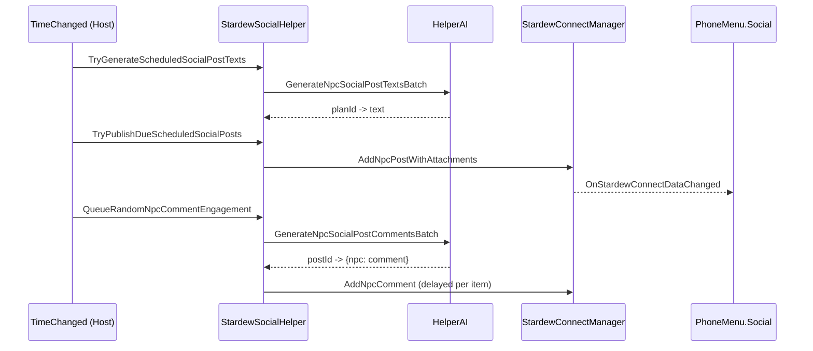

# Social App and Content Generation

This document explains StardewConnect data model, UI behavior, and how posts/comments/likes are generated.

## 1. Core Modules

- UI and interactions: `HelperSocial/PhoneMenu.Social.cs`
- Domain model and persistence: `HelperSocial/StardewConnectManager.cs`
- Automated daily simulation: `HelperSocial/StardewSocialHelper.cs`
- Multiplayer authority and sync: `HelperSocial/SocialCoopSync.cs`

## 2. Social Data Model

Main objects (persisted per save):

- `StardewConnectPost`
  - author, text, season/day/year/time, total game time
  - likes (`LikedBy`)
  - comments
  - attachments (`ImageFile`, `FromPlayerFolder`, `ImageTag`)
  - merged `PostTag`
  - per-player read-comment counts
- `StardewConnectComment`
- `StardewConnectProfileStats`
- shared player avatar map
- social notification dismissal keys
- last social visit snapshot

Persistence files are written via `StardewConnectManager.SaveData()`.

## 3. Social UI Modes

`PhoneMenu.Social.cs` supports:

- Feed view
- Post detail view
- Profile view
- Create-post menu
- Notification menu

When opening social app:

- resets detail/create/profile flags
- marks phone as opened today (`MessageManager.MarkPhoneOpenedToday()`)
- records visit snapshot (`StardewConnectManager.MarkSocialAppVisitedNow()`)
- snaps feed to first post on/after last visit if possible

## 4. Player Actions

### Create post

`TryCreatePlayerSocialPost()` -> `StardewConnectManager.AddPlayerPostWithAttachments(...)`

Rules:

- post can be text-only, image-only, or mixed
- max selected create images: 3
- attachment file names are normalized
- in coop farmhand mode, request is sent to host and applied there

### Add comment

`TryCreatePlayerSocialComment()` -> `StardewConnectManager.AddPlayerComment(...)`

Rules:

- empty comment is rejected
- local comment input reset after success
- read counts are updated if local player is author or currently viewing post

### Like/unlike

`TogglePostLikeByPlayer(postId)`:

- toggles desired state
- routes to host in farmhand mode
- host applies canonical like state and broadcasts delta

### Delete post

`DeletePost(postId)`:

- only player-authored posts can be deleted
- deleting player name must match post author
- in farmhand mode delete request is routed to host

## 5. Notification Generation Logic

Notifications are derived from posts/comments and filtered by dismissal keys.

Types:

- New comments on local-player post
- Favourite NPC new post
- Tagged in post (`PostTag` contains player tag or text mention)
- Tagged in comment (`@Player` or `@<playerName>`)

Entries are sorted by chronological key plus total game time.

Dismissal behavior:

- dismiss by post
- dismiss all
- pruning of stale dismissal keys when source entries no longer exist

## 6. Daily Social Simulation (Host Side)

Host-only (`ShouldHostRunSocialSimulation()`) behavior:

### 6.1 Daily scheduling

At day start:

- `PrepareDailyRandomNpcSocialPosts()` builds plan list for the day.
- Number/timing from config and key mode.
- Each plan chooses format:
  - include text or not
  - image count 0..3
- NPC photos are pre-captured (`TryCaptureNpcPhoto(...)`) at planned time context.

### 6.2 Text generation

On `TimeChanged`:

- `TryGenerateScheduledSocialPostTexts(currentTime)` triggers once when generation time is reached.
- Batches all plans needing text into one AI call (`GenerateNpcSocialPostTextsBatch`).
- Stores generated text on each plan.

### 6.3 Publish due posts

`TryPublishDueScheduledSocialPosts(currentTime)`:

- publishes plans with time <= now and text ready (if required)
- uses `AddNpcPostWithAttachments(...)`

## 7. Automated Engagement (Comments and Likes)

At configured intervals:

- `QueueRandomNpcCommentEngagement()`
- `QueueRandomNpcLikeEngagement()`

Post selection strategy mixes:

- random recent posts by day windows
- popular posts within windows

Comment flow:

1. Build post -> selected commenters map.
2. Batch AI call via `GenerateNpcSocialPostCommentsBatch(...)`.
3. Parse per-post per-commenter text.
4. Queue delayed `AddNpcComment(...)` actions.

Like flow:

- randomly picks eligible NPC actor names per post.
- excludes author and optionally already-liked users.
- queues delayed `SetPostLike(..., liked=true)`.

## 8. Attachment and Tag Behavior

- Post attachments are normalized and migrated into `Attachments` list.
- Missing attachment tags are populated from image tag store.
- `PostTag` is refreshed as merged attachment tags.
- UI supports per-post image navigation and optional tag tooltip display.

## 9. Coop Interaction Summary

- Farmhands request social mutations from host.
- Host mutates canonical state in `StardewConnectManager`.
- Host broadcasts post/comment/like/delete/avatar deltas.
- Farmhands apply deltas and invalidate image caches as needed.

## 10. Sequence Overview

## 11. Important Constraints

- Farmhands do not run canonical random social simulation.
- Post/comment AI generation depends on AI quota and inactivity lock status.
- Notification visibility depends on dismissal state and read-comment counts.
