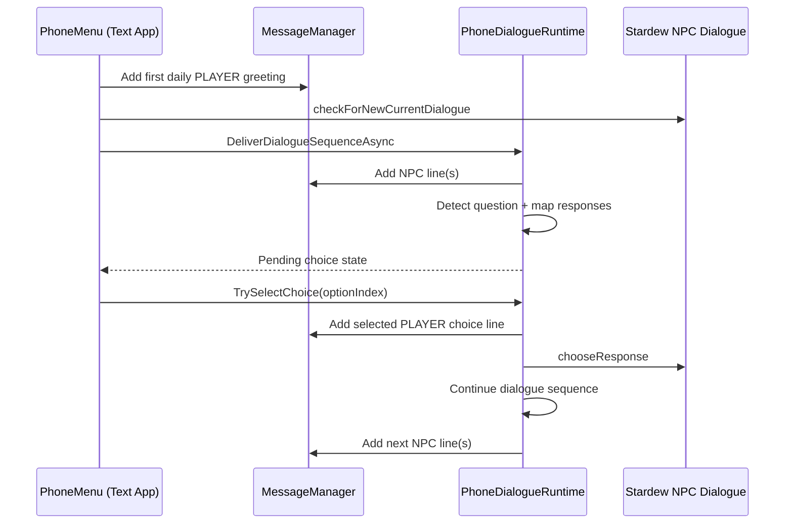

# Messenger App and Dialogue Runtime

This document describes the messenger pipeline, including base-game dialogue questions and choices.

## 1. Core Files

- Message store and persistence: `HelperMessage/MessageManager.cs`
- Messenger UI and input: `HelperMessage/HelperMessage.cs`
- Dialogue question runtime: `HelperMessage/PhoneDialogueRuntime.cs`
- Dialogue models: `HelperMessage/PhoneDialogueModels.cs`
- Trigger points: `ModEntry.cs` and `GameLauched.cs`

## 2. Conversation Keys and Display Names

`MessageManager` supports both NPC and player conversations.

- NPC key: NPC internal name (e.g. `Abigail`)
- Player key: `@player:<playerName>`

Helpers:

- `BuildPlayerConversationKey(...)`
- `TryGetPlayerNameFromConversationKey(...)`
- `GetConversationDisplayName(...)`

## 3. Message Storage Model

Primary collections:

- `npcMessages`: persistent history per conversation
- `npcMessagesToday` (in `ModEntry`): current-day in-progress lines
- `unreadCounts`
- `latestAdd` (sorting recency)

Behavior:

- NPC conversations split between historical and today lists.
- Player conversations append directly to persistent list.
- Global max per conversation is trimmed by config (`MaxMessage`).

## 4. Messageability Rules

NPC conversation allowed when:

- target exists
- target is villager, socializable, non-monster
- requirement met:
  - meet mode: friendship entry exists
  - friend mode: at least 1 heart

Player conversation allowed when:

- target player name is valid
- not the local player

## 5. Text App UI Flow

Two major modes:

- Conversation list
- Active chat thread (`selectedNpc != null`)

Thread view supports:

- bubble rendering for text, system lines, and photo messages
- per-photo group navigation
- tag hover tooltip for photos
- pending dialogue choice bubbles
- quick-action menu and photo picker

Input is disabled in these cases:

- first daily greeting required and not sent yet
- pending dialogue question choice exists

## 6. Sending Messages

`onPlayerSend()` flow:

1. Validate selected target and input-enabled state.
2. Block send when pending dialogue choice exists.
3. Collect text and selected photo paths (max 5 in chat).
4. If target is player conversation:
   - send via `TrySendDirectPlayerChat(...)`
   - append local message/photo entries immediately
5. If target is NPC conversation:
   - append local player text/photo entries
   - call `sendTextMessage(...)` for AI reply queue

Photo metadata lines use prefixes:

- `PlayerPhoto:`
- `PlayerPhotoTag:`
- `NpcPhoto:`
- `NpcPhotoTag:`

## 7. Inactivity Batch Reply Queue

For NPC chat AI replies:

- `sendTextMessage(...)` appends payload to per-NPC queue.
- Last input timestamp is updated.
- A per-NPC timer waits for inactivity window.
- `WaitForReplyInactivity(...)` triggers when delay expires.
- `SendBatchMessage(...)` merges queued payloads and performs one AI call.

Important details:

- Chat queue is high-priority in AI limiter (`queueKey` like `chat:<npc>`).
- UI refreshes `messageHistory` if that NPC chat is currently open.

## 8. Daily First Message and Base Dialogue Entry

When player has not talked to NPC yet that day:

- UI shows first-greeting button.
- Clicking it adds `PLAYER: <greeting>`.
- `ModEntry.FirstDailyText(...)` runs.
- If NPC not talked today:
  - marks talked today
  - calls `npc.checkForNewCurrentDialogue(...)`
  - sends `npc.CurrentDialogue` to `PhoneDialogueRuntime.DeliverDialogueSequenceAsync(...)`

If already talked today:

- fallback to AI reply path (`SendMessageToAssistant`).

## 9. Base Dialogue Parsing and Choice Handling

`PhoneDialogueRuntime` converts in-game `Dialogue` objects into phone chat lines.

### 9.1 Safety guard

`ContainsUnsafeCommand(...)` rejects dialogue lines containing commands like:

- `$v`
- `$action`

If unsafe, runtime sends fallback text asking for in-person talk.

### 9.2 Text normalization

`NormalizeDialogueTextForPhone(...)` strips tokens such as:

- `%noturn`, `$k`, `$e`
- inline emotion tokens (`$h`, `$s`, etc)
- portrait tokens (`$0`..`$32`)
- braces and extra whitespace

### 9.3 Iteration model

Per dialogue:

1. `prepareCurrentDialogueForDisplay()`
2. read line with `getCurrentDialogue()`
3. optionally skip first line if it matches a passed skip marker
4. emit NPC line to chat
5. if line is a question:
   - map response options to `PhoneDialogueOption`
   - store pending state in `PendingChoices`
   - stop sequence and wait for player selection
6. otherwise `exitCurrentDialogue()` and continue

### 9.4 Choice selection

`TrySelectChoice(npcName, optionIndex)`:

- validates pending state and option index
- adds selected choice text as player line
- calls `Dialogue.chooseResponse(...)`
- clears chat draft input if current chat is open
- starts continuation delivery asynchronously

Continuation uses `skipFirstLineIfMatches` to avoid re-printing the prompt line.

## 10. UI Binding for Pending Choices

- `DrawPendingDialogueChoices(...)` renders options as right-side bubbles.
- `HandleTextDialogueChoiceClick(...)` maps click bounds to option index.
- While pending choice exists:
  - input field becomes read-only with waiting text
  - send action is blocked

## 11. Sequence Overview

## 12. Persistence Notes

At save time:

- merged conversation history is saved to `npcMessages` file.
- phone settings (theme/sound/avatar/favorites/unread/latest/today-open marker) are saved.

At day start:

- daily temporary message state is reset.
- pending dialogue choices are cleared.
