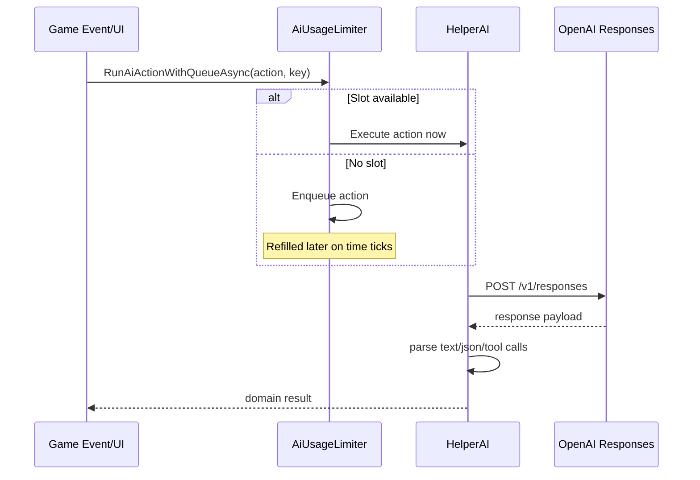

# AI Model and Usage Adaptation

This document explains AI request entry points, model switching, quota enforcement, and queued execution.

## 1. Core Files

- AI requests and parsing: `HelperAI/HelperAI.cs`
- Credit/day quota and queue: `HelperAI/AiUsageLimiter.cs`
- Triggers from game loop: `GameLauched.cs`

## 2. AI Entry Points

### Chat response

- `SendMessageToAssistant(npcName, text, type)`
- Uses OpenAI Responses API (`/v1/responses`)
- For normal chat (`type == "response"`), can include tool definitions (e.g. schedule event)

### Daily conversation memory summarization

- `SummaryConversationsBatch(conversationsByNpc, bypassAiLimit)`
- Batches multiple NPC summaries in one JSON-output request

### Social post text generation

- `GenerateNpcSocialPostTextsBatch(scheduledPosts)`
- One batched JSON request for many planned posts

### Social comments generation

- `GenerateNpcSocialPostCommentsBatch(commenterNamesByPostId)`
- One batched JSON request covering multiple posts and commenter sets

## 3. Model and Reasoning Selection

Controlled by `HandleAiModelSettingTimeChanged(newTime)`.

### Mode A: User-provided API key (`Config.OpenAIKey` not empty)

- Uses user-selected model (`Config.OpenAIModel`) directly.
- Reasoning effort is mapped by model family.
- No shared-usage adaptive downgrading.

### Mode B: Shared-key mode (`Config.OpenAIKey == ""`)

- Periodically checks organization usage (`GetOpenAIUsage`) every 300 time units.
- Adapts model quality by regular-model token usage:
  - `> 10,000,000`: switch to `gpt-5-mini`
  - `> 15,000,000`: switch to `gpt-5-nano`, mark reduced quality, notify user
  - `> 25,000,000`: disable AI (`IsMaxedLimit = true`), notify user
- If usage check fails 3 times in a row, AI is temporarily disabled.

## 4. Local Quota and Queueing (Credit System)

`AiUsageLimiter` enforces limits when shared-key mode is active.

Base limits:

- credit bucket max: 4
- daily total max: 10
- refill: +1 credit every 2 in-game hours (if daily quota still available)

Important methods:

- `TryConsumeAiCallSlot()`
- `RunAiActionWithQueueAsync(action, queueKey, highPriority)`
- `TriggerQueuedAiActions()`
- `HandleAiUsageTimeChanged(newTime)`

Queue behavior:

- If no slot is available, action is queued.
- High-priority queue is processed before normal queue.
- Queue key deduplication prevents duplicate work for same key.
- Chat replies use high-priority queue keys such as `chat:<npcName>`.

## 5. Phone-Inactivity AI Lock

Separate from token/credit limits.

- If phone is not opened for 3+ days (in shared-key mode), AI is disabled for that day.
- Opening text/social app marks phone active and clears lock.
- Lock is checked before AI execution paths and queue processing.

## 6. Request Shape and Parsing Strategy

### Request shape

Most calls include:

- `model`
- `input` with developer + user roles
- `text` format preferences (plain text or `json_object`)
- `reasoning` effort object

### Parsing strategy

- `GetResponseOutputText(...)` extracts final text from Responses payload.
- For structured outputs, helper parsers extract JSON payloads from:
  - plain JSON
  - fenced code blocks
  - mixed content around JSON

Used parsers include:

- `TryParseBatchConversationSummaries(...)`
- `TryParseGeneratedNpcSocialPosts(...)`
- `TryParseGeneratedNpcSocialCommentsBatch(...)`

## 7. Tool Call Integration in Chat

For response chat, tool list can include `schedule_event` function.

When model emits function call:

- Arguments are parsed from call payload.
- Event type is validated against registered UnlimitedEvent definitions.
- Confirmation dialog is shown to player.
- On confirm, schedule menu opens via UnlimitedEventExpansion API.

## 8. Error Handling

Common behavior on failed HTTP responses:

- logs by status code (403/429/500/503 mappings)
- returns fallback system/error text or empty map depending on entry point
- no exception leaks to UI caller paths

## 9. Configuration and Tuning Points

Key controls:

- `OpenAIKey`
- `OpenAIModel`
- `CharacteristicMode`
- `MaxSummaryWordCount`
- `BetterQualityComment`

And quota behavior in `AiUsageLimiter` constants:

- `AiCreditRemaining`
- `DailyAiLimit`

## 10. Sequence Overview

## 11. Security/Operations Note

The current source contains fallback key fragments in code for shared operation mode.

Recommended hardening:

- move all secrets to secure configuration or environment variables
- avoid shipping embedded keys in distributed source/binaries
- treat admin usage endpoint credentials as highly sensitive
