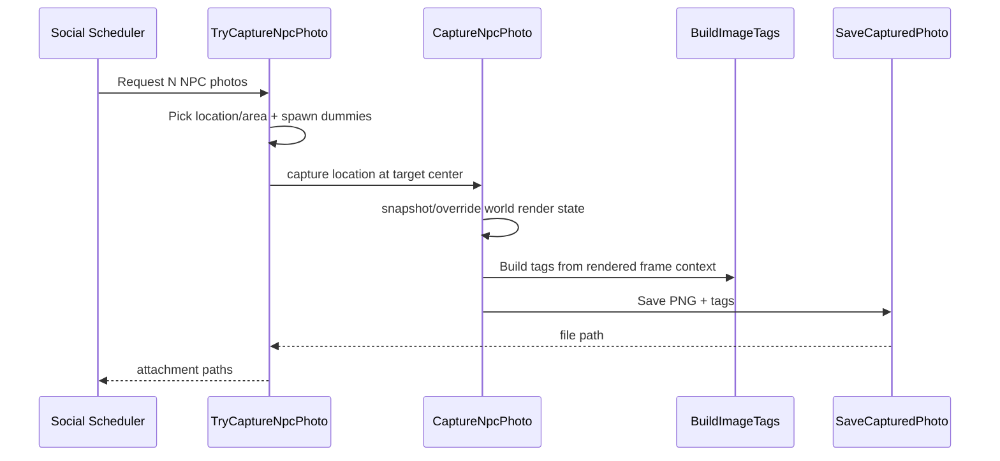

# Image Capture and NPC Capture

This document covers the player camera capture flow, off-screen NPC capture pipeline, and image tagging/storage behavior.

## 1. Core Files

- Player and off-screen rendering capture: `HelperCamera/ImageCapture.cs`
- Tag generation and tag persistence: `HelperCamera/ImageTagging.cs`
- NPC staged scene capture helper: `HelperSocial/StardewSocialNpcCaptureHelper.cs`

## 2. Player Camera Capture Flow

Trigger:

- In camera app, capture button sets `ModEntry.takeScreenshot = true`.
- `OnRendered(...)` consumes flag and performs capture.

Process:

1. Read backbuffer pixels.
2. Compute UI capture rectangle from:
   - portrait/landscape mode
   - square mode
   - zoom factor (`cameraZoomFactor`)
3. Convert UI bounds to backbuffer coordinates.
4. Clamp capture bounds to valid backbuffer area.
5. Crop pixel array and build texture.
6. Save via `SaveCapturedPhoto(...)` with generated tags.

Output:

- Player capture goes to `userdata/<save>/player_photo`.
- If square mode was requested, near-square captures can be normalized to exact square.

## 3. Off-Screen NPC Capture Pipeline

Main call path:

- `TryCaptureNpcPhoto(...)` -> `CaptureNpcPhoto(...)`

### 3.1 Scene planning (`TryCaptureNpcPhoto`)

For each requested photo:

- Picks a location/area from area-tag definitions (with SVE/RSV conditional support).
- Ensures location is not currently occupied by farmers.
- Finds walkable interior target tiles.
- Spawns dummy NPC clone for target NPC.
- Optionally spawns additional companion dummy NPCs.
- Hides existing visible NPCs in target location to avoid clutter.
- Applies natural offsets, facing directions, and group center.
- Chooses zoom based on group size.
- Calls off-screen renderer and then restores state/visibility.

### 3.2 Off-screen render (`CaptureNpcPhoto`)

High-level steps:

1. Snapshot global render/world state (`PhotoRenderStateSnapshot`).
2. Override world pointers:
   - `Game1.currentLocation`
   - `Game1.viewport`
   - `Game1.timeOfDay` (optional capture-time override)
3. Prepare location render state:
   - location-specific flair setup
   - day/night tile handling with reversible snapshot
   - capture-sized lightmap allocation
   - ambient/outdoor light recomputation
   - map/shared light source rebuild
4. Draw world into off-screen `RenderTarget2D`.
5. Build image tags for resulting frame.
6. Restore all snapped state and temporary sprites.

Failure path includes explicit recovery to avoid breaking later draws:

- end sprite batch if needed
- end map display scene if needed
- reset render target

## 4. Image Tag Generation

Tags are produced by `BuildImageTags(...)` from scene context.

Potential tag sources:

- location/home/farm tags
- event tags (festival, unlimited-event memory, event actors)
- area tags from `area_indoor.json` / `area_outdoor.json` + optional overrides
- weather tags
- characters in frame (player and NPCs)
- held item tag for player
- crops, fruit trees, forageables
- furniture and displayed table items
- pets and farm animals
- "front of building" tags when near doors

Tag limits are enforced per category (for example max NPC tags, max forage tags).

## 5. Tag Persistence Model

Global dictionary:

- `ImageTags: Dictionary<string, string>`

Stored at:

- `userdata/<save>/imageTags` (filename -> semicolon-separated tags)

Lifecycle:

- `LoadImageTags()` loads and cleans orphaned entries.
- `SetImageTags(...)` writes/updates tags for saved image.
- `RemoveImageTags(...)` removes tags on file delete.

## 6. Storage and Retention Rules

`SaveCapturedPhoto(...)`:

- writes PNG with opaque normalization.
- adds/updates tag entry for file.
- enforces retention limits:
  - player photos: `PlayerMaxPhoto`
  - shared NPC photos: `NpcMaxPhoto`
- deletes oldest overflow files and removes their tag entries.

## 7. Social/Messenger Integration

- Social post attachments and direct player-chat attachments rely on shared photo files plus tag lookup by filename.
- Off-screen NPC captures are used by scheduled social-post generation.
- Chat and social UI can display and navigate attached images; tag text may be shown as tooltip.

## 8. Sequence Overview

## 9. Operational Notes

- Off-screen rendering touches global `Game1` rendering state; snapshot/restore is critical.
- Location lighting and tile appearance are rebuilt for capture-time correctness.
- Tag generation relies on multiple reflective helpers to support variant game object representations.
- If image load fails in UI, caches can be invalidated (`ResetSocialImageLoadCache` / chat equivalents).
